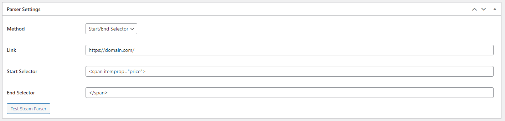
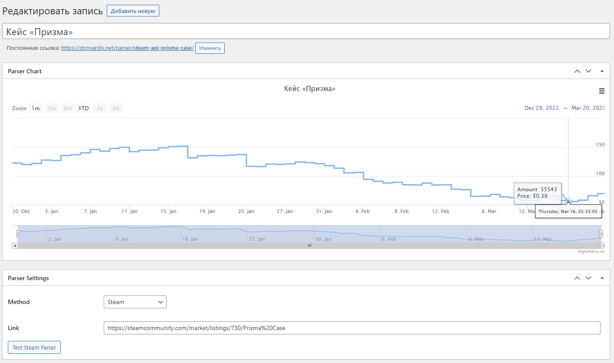

# Parser Manager Plugin for WordPress [Beta](https://ru.wikipedia.org/wiki/Бета-тестирование)

> **Warning**: Плагин в разработке! 
> Может работать не стабильно.

Представляем вашему вниманию плагин, с которым без знаний программирования, сможете создавать свои парстеры данных и выводит их на график.

### Добавление нового парсера
1. Выберете метод `Start/End Selector`
2. В поле **Link** вводите ссылку на страницу, откуда будут браться данные
3. В поле **Start Selector** вводите html, который находится до вашего значения
4. В поле **End Selector** вводите html, который находится после вашего значения

Например, ваше значение находится в данном блоке `265`, то в поле **Start Selector**, нужно ставить ``, а в поле **End Selector** , нужно ставить ``.

Поле этого всё что между кодом **Start Selector** и **End Selector** будет парситься

Доступные методы парсеров:
- Start/End Selector
- XPatch
- Steam

### Особенности:
- Парсинг запускается один раз в сутки
- Для вывода графика используется удобная библиотека Highcharts

## Демо
